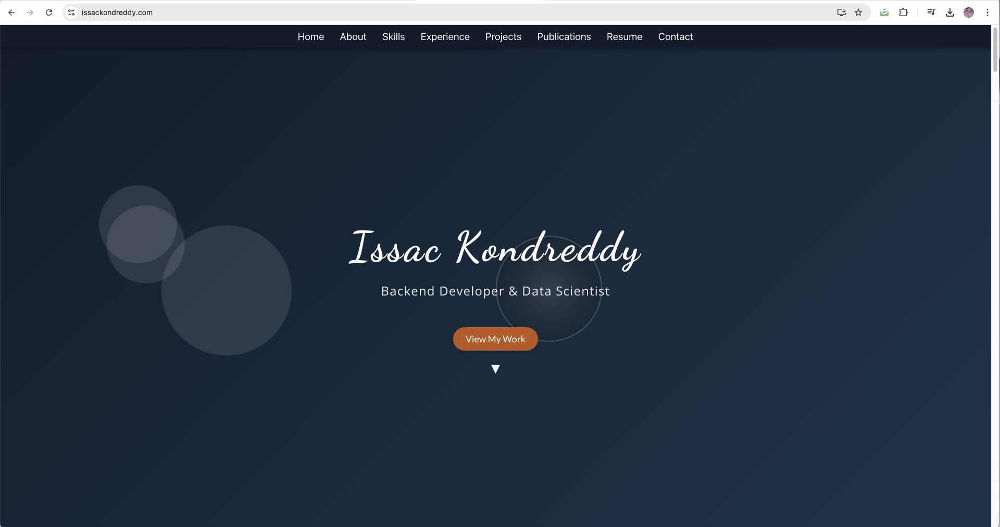

# Issac Kondreddy Portfolio

This is the source code for My personal portfolio, built using **React** and deployed on **Hostinger**. It showcases skills, projects, experience, publications, and includes a contact form for reaching out. This is the source code for Issac Kondreddy's personal portfolio, live at [issackondreddy.com](https://issackondreddy.com).
## Website Preview



## Table of Contents

- [Features](#features)
- [Technologies](#technologies)
- [Installation](#installation)
- [Usage](#usage)
- [Deployment](#deployment)
- [License](#license)

---

## Features

- **Responsive Design**: Works on all device sizes.
- **Skills & Expertise**: Displays skills with rotating icons and categories.
- **Projects**: Showcases personal and research projects with links to GitHub and live demos.
- **Experience**: Highlights internship experience, including tasks and achievements.
- **Publications**: Lists all academic publications with links to journals.
- **Contact Form**: Functional contact form integrated with **EmailJS** to send messages directly from the website.
- **Favicon**: Custom favicon displayed on the browser tab.

## Technologies

- **Frontend**: React.js
- **Styling**: CSS3 with custom animations (floating orbs, spiral circles)
- **Email Service**: EmailJS for sending messages from the contact form
- **Deployment**: Hosted on **Hostinger** (accessible at [issackondreddy.com](https://issackondreddy.com))
  
## Installation

If you wish to run this project locally, follow these steps:

1. **Clone the repository**:
   ```bash
   git clone https://github.com/Issac-Kondreddy/portfolio.git
   cd portfolio
   ```
2. **Install the Dependenies** :Make sure you have Node.js and npm installed. Then, run:
   ```bash
   npm install
   ```
3. **Run the development server**
   ```bash
    npm run
   ```
The app will run locally on ```http://localhost:3000```.

## Deployment
To deploy updates to the live website:

Run npm run build to create a production-ready build.
Log in to your Hostinger file manager.
Navigate to the public folder of your domain and delete old files.
Upload the new build files (from the build folder) to the root of your website.
Clear the cache in your browser if changes aren't visible immediately.

## Contact
If you have any questions or suggestions, feel free to contact me via the Contact Form on the website or reach me at [issackondreddy@gmail.com].
